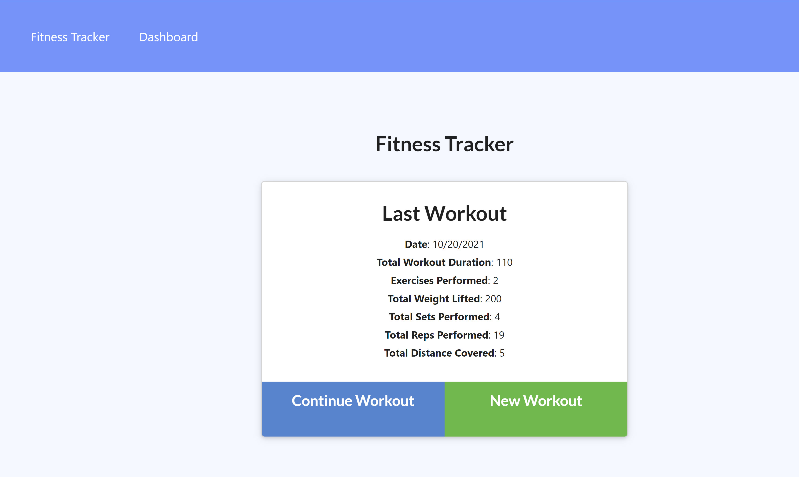
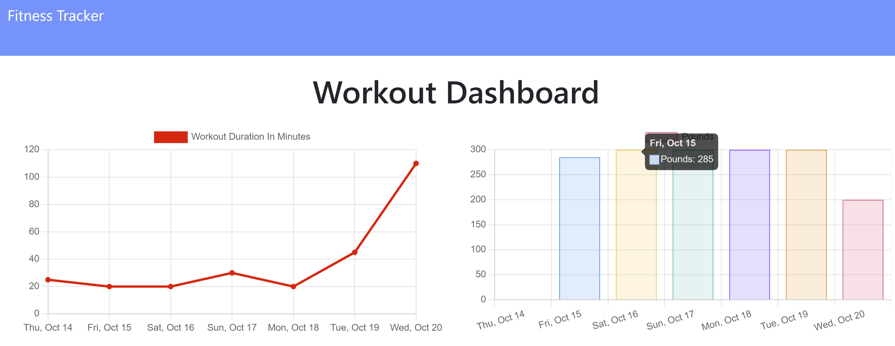

# Workout Tracker [")](https://opensource.org/licenses/MIT)
  
## Description
This application was created as a means for users to easily and conveniently track their workouts and the stats associated with them. It makes it easy to see progress, and weak spots in your fitness regimen. 

I was tasked with building out and completing the database and backend for this project. It utilizes MongoDB NoSQL database as well as the Mongoose ODM for schema and constraints. It also utilizes Express and Chart.js for displaying visuals of workout trends. It was an excellent exercise in learning and developing aggregate queries to essentially pivot related data together, as well as writing a NoSQL Schema and defining the constraints in that respect.

Technologies used: 

* MongoDB
* Mongoose
* Express
* Chart.js
  
  

  ---
  ## Table of Contents
1. [Usage](#usage)
1. [Contribution](#contribution)
1. [License](#license)
1. [Questions](#questions)

  ---
  
  ## Usage
    
This application is relatively simple to use. On the home page you will be shown the stats for your most recent workout and will be given the option to either continue that workout and add additional exercises to it, or to start a new workout and begin adding exercises to it. 

When an option is selected, it will bring you to the exercise submit page. The idea is that one "workout" can contain multiple exercises, and each exercise can fall either into the category of "resistance" (think weight lifting) or cardio (think running). So for instance, you can put down that you ran for 2 miles and enter duration, distance, etc. Then you can submit another exercise such as "bench press" and enter reps, sets, weight, etc. This information then gets stored into the database. When the user enters their last exercise, instead of clicking add another exercise, they should click complete- this will redirect them to the landing page showing the stats for the last workout they just entered.

Users can also view charts of their progress showing total weight lifted, and duration of cardio exercises by navigating to the "Dashboard" page, which is linked in the main Nav Bar at the top. 

---

## Contribution
    
Thank you for considering contributing to this project. If you would like to contribute, feel free to fork the repository, add your functionality or bugfix, and submit a pull request. I will review the changes and contact you with any questions or concerns.

---

## License
  
  This application is licensed under **The Massachusets Institute of Technology License (MIT)**.
  
  Click the license badge below for more information and usage guidelines:
  
  [")](https://opensource.org/licenses/MIT)
  
  Click [here](https://www.mit.edu/~amini/LICENSE.md
  "MIT Full Terms and Conditions") to view the full terms and conditions text of MIT.
  
  ---
  
  ## Questions
  
Please do not hesitate to reach out with any questions you may have. I can be reached in the following ways:

* Email: [ElijahARomer@gmail.com](mailto:ElijahARomer@gmail.com)
* GitHub: [ElijahRomer](http://www.github.com/ElijahRomer)

Thank you for reaching out and I look forward to getting in touch with you soon!

